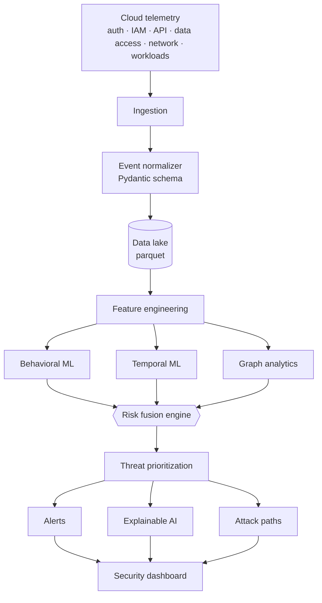
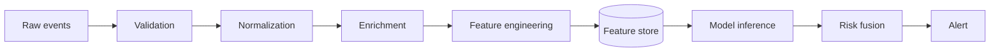
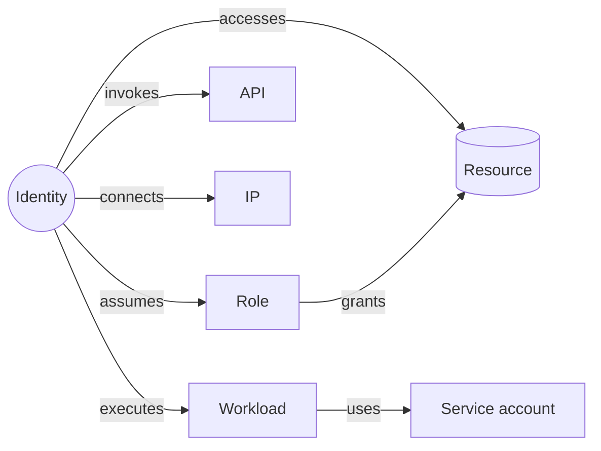

<div align="center">

# CloudSentinel

**AI-Driven Behavioral Threat Detection for Modern Cloud Infrastructure**

`BEHAVIOR` + `TIME` + `GRAPH` + `RISK FUSION` → **Unified Cloud Threat Risk**

[](../../actions/workflows/ci.yml)
[](../../actions/workflows/security.yml)
[](LICENSE)
[](pyproject.toml)

</div>

> **Status:** complete, built in 18 phases.
> Phases 1–9 are complete (foundation through graph analytics) — see [CHANGELOG.md](CHANGELOG.md)
> and the [roadmap](#roadmap).

---

## 0. What is actually novel here

The detection is conventional: isolation forests, autoencoders, graph features
and SHAP over cloud audit logs is a well-travelled path, and the evaluation runs
on telemetry this repository generated itself. Read the results with that in
mind.

What is unusual is [`cloudsentinel audit`](docs/evaluation-integrity.md) — a
model-agnostic harness that audits the **evaluation** rather than the model.
Six defects occurred while building this project. All six passed lint, type
checks and the test suite. All six produced plausible metrics. Three changed a
published conclusion and two reversed its sign. None was a bug in a model.

```bash
cloudsentinel audit -i data/features/store.parquet
```

Eight checks — temporal ordering, label leakage, training coverage, group
statistic depth, alert-budget compliance, determinism, row-order invariance and
batch independence — each reproducing a defect that really happened here, each
returning a measurement rather than a boolean. On its first run it failed
against this repository's own test fixture, which contained three perfect
separators.

## 0b. Non-human and AI-agent identities

The one scenario nothing detected through phases 6–11 was AI-agent identity
abuse: an agent's tool calls are individually mundane, and volume and novelty
were not enough. This layer describes *how* an identity works rather than what
it did — cadence regularity, tool entropy, tool novelty, read-to-act ratio and
burstiness — and it required fixing the simulator first, since every identity
previously had uniformly scattered timestamps and cadence carried no
information at all.

Measured cadence regularity now separates the population cleanly (median, benign
windows): humans 0.000, ai_agent 0.634, workload 0.643, service_account 0.679,
ci_cd 0.806.

| detector | PR-AUC (3 seeds) | Δ vs baseline | wins |
|---|---|---|---|
| xgboost_agent | 0.955 ± 0.013 | +0.032 vs xgboost | 3/3 |
| agent_risk | 0.040 ± 0.004 | −0.643 vs behavioral_distance | 0/3 |

**The features help; the hand-weighted score built on them does not.** Adding
them to a trained model gains +0.032 PR-AUC with an effect size of 0.81 — small,
consistent, and at the edge of what three seeds can support. The standalone
`agent_risk` score fails outright, and it fails the same way risk fusion did in
§12: a fixed linear combination dilutes, while a model that uses the same
features conditionally extracts value from them. That is now the second
independent occurrence of this pattern in the project, which makes it a finding
rather than an accident.

Restricted to non-human identities on one seed, `xgboost_agent` reaches 0.886
against 0.840 for plain XGBoost. The agent-abuse scenario itself contributes
only 4 windows to a test split, so nothing about that scenario specifically can
be concluded here.

## 0c. Provenance and verification

This project was built in a shared working directory, and partway through, files
began appearing in it that this build did not write. None was accepted on trust:
each was audited, and the audit produced five measured defects, two of which had
already generated wrong published results. The full account is in
[docs/provenance.md](docs/provenance.md).

Every file in `MANIFEST.sha256` passed `ruff`, `mypy`, `bandit` and the complete
test suite when it was recorded:

```bash
sha256sum -c MANIFEST.sha256
```

Anything that differs from the manifest was not part of that verification.

## 1. Overview

CloudSentinel is a defensive cloud-security platform that scores the *behaviour*
of an identity over time, in the context of the graph of resources it touches —
instead of matching isolated events against static rules.

It combines four independent intelligence layers and fuses them into a single
explainable risk score:

| Layer | Question it answers |
|---|---|
| **Behavioral** | Is this identity acting unlike itself? |
| **Temporal** | Has its behaviour drifted or broken pattern over time? |
| **Graph** | Does its position in the resource graph enable lateral movement? |
| **Risk context** | How privileged is it, and how sensitive is what it touched? |

## 2. Problem

Modern cloud attacks mostly use **legitimate, compromised credentials**. Rule-based
detection struggles with legitimate actions used maliciously, gradual behavioural
change, lateral movement, privilege escalation, exfiltration, service-account and
CI/CD credential abuse, and — increasingly — non-human and AI-agent identities.

## 3. Research question

> Does combining behavioral analytics, temporal machine learning, graph analytics
> and risk fusion detect cloud threats with a **lower false-positive rate** than
> rule-based or single-model approaches?

## 4. Hypotheses

| # | Hypothesis | Outcome |
|---|---|---|
| H1 | Behavioral models detect attacks that rule-based systems miss | **supported** — +0.774 PR-AUC, 3/3 runs |
| H2 | Temporal analysis improves detection of gradual behavioural change | **not supported** — the sequence model lost to the dense one, 0/3 |
| H3 | Graph analytics improves detection of lateral movement | **undecided** — −0.015 ± 0.038, inside noise |
| H4 | Risk fusion over multiple signals reduces false positives | **refuted** — fusion scored below its own best component, 0/3 |
| H5 | Explainability increases the operational usefulness of alerts | **not measurable here** — needs analysts, not simulations |

Each hypothesis maps to an experiment in [§17](#17-experiments); every outcome
above comes from a real run and none of them was the outcome the design
expected. Two were reversed by fixing defects in the evaluation itself, which is
recorded in [CHANGELOG.md](CHANGELOG.md).

## 5. Architecture



Data pipeline:



### Event schema

Every source is normalized into a strict `CloudEvent` (Pydantic v2) before it
touches the data lake. JSON Schema files live in [`docs/schemas/`](docs/schemas).

```bash
cloudsentinel schema example                 # canonical valid event
cloudsentinel schema export -o docs/schemas  # JSON Schema for both contracts
cloudsentinel schema validate data/synthetic/events.parquet
```

Ground-truth labels are quarantined in a dedicated `labels` object; the feature
layer consumes `CloudEvent.feature_payload()`, which cannot contain them — target
leakage is prevented structurally, not by review.

## 6. Dataset

Two sources, both clearly labelled in every report:

- **Synthetic** — produced by the built-in simulator, with ground-truth labels
  per event and per scenario. Reports carry a `SYNTHETIC DATA EXPERIMENT` banner.
- **Public** — public cloud-audit datasets are used where licensing allows, as a
  reality check on the synthetic baselines.

## 7. Attack simulator

`cloudsentinel simulate` generates realistic normal behaviour (recurring users,
hours, IPs, countries, APIs, resources, weekly/monthly seasonality) plus ten
labelled attack scenarios:

1. Credential compromise · 2. Account takeover · 3. Privilege escalation ·
4. Data exfiltration · 5. Lateral movement · 6. Cryptomining ·
7. Suspicious service account · 8. CI/CD credential abuse ·
9. Cloud storage abuse · 10. AI-agent identity abuse

```bash
cloudsentinel scenarios                     # list scenarios and their targets
cloudsentinel simulate --days 45 --identities 250
```

The simulator emits **log records only** — no exploit code, no payloads.

Two design choices matter more than the scenarios themselves:

* **Attacks share the vocabulary of normal traffic.** Both draw from the same
  action catalog and the same estate. If attacks used private action names, any
  model would separate them trivially and every metric would be meaningless.
* **Benign traffic contains rare foreign logins and VPN usage** (~0.1% and ~0.6%
  of events). Without them, "new country" would be a perfect separator and the
  rules-vs-ML experiment would be rigged in favour of rules. On the default
  dataset the naive rule *foreign country ⇒ attack* yields **4.3% precision at
  18.3% recall** — which is the point.

## 8. Feature engineering

Four families: identity (login frequency, unique IPs/ASNs/countries, failed-login
rate, authentication velocity, unusual-hour score, privilege level), API
(calls/min, unique services, unusual-API ratio, sensitive-API count, privilege
changes), data (objects accessed, volume, download velocity, sensitive-object
ratio, exfiltration score) and network (bytes in/out, destination entropy,
unusual-port ratio).

33 features in total, declared in `features/spec.py`. The feature store has one
row per identity per hour.

```bash
cloudsentinel pipeline run -i data/synthetic/events.parquet
cloudsentinel features build -i data/synthetic/events.parquet
cloudsentinel features describe
```

On top of them, a custom **Behavioral Distance Score** normalises the gap between
current behaviour and the historical baseline (robust z-score, percentile
deviation and Mahalanobis distance where the covariance is usable) onto `0 → 1`.

Every baseline is **expanding and shifted**: statistics for window *t* come from
windows strictly before *t*, so the score cannot learn from the campaign it is
meant to detect. Windows without enough history return `NaN` rather than a
confident zero.

## 9. Machine learning

- **Baselines:** Isolation Forest, LOF, One-Class SVM, Random Forest, XGBoost
- **Deep learning:** Autoencoder, VAE, sequence (GRU) Autoencoder — implemented
  on JAX, CPU-trainable in under a minute each (see
  [ADR-0002](docs/adr/0002-deep-learning-backend.md))
- **Experimental:** Temporal Transformer, Graph Neural Network

Evaluation uses precision, recall, F1, ROC-AUC, PR-AUC, FPR, FNR, detection
latency and MTTD. **Accuracy is deliberately not a headline metric** — the
classes are heavily imbalanced.

## 10. Temporal intelligence

Rolling mean/std, EWMA against a weekly reference, hour-of-week seasonality,
online CUSUM change-point detection and behavioural drift → **Temporal Risk
Score**.

CUSUM rather than an offline segment search because detection has to run on a
stream: the statistic updates with each window and never revisits the past.

## 11. Graph analytics



Degree and sampled betweenness centrality, Louvain communities, suspicious
shortest paths and attack-path reconstruction → **Graph Risk Score**, plus blast
radius and lateral-movement potential per identity.

The graph is built from an earlier period of the **same environment**. A graph
fitted elsewhere makes every edge look new and the score collapses to a constant —
there is a test asserting exactly that.

## 12. Risk fusion

```
Risk = 0.25·Behavioral + 0.20·Identity + 0.20·Graph
     + 0.15·Data access + 0.10·Privilege + 0.10·Temporal
```

Weights live in `config/default.yaml`, are overridable per environment
(`CS_RISK__WEIGHTS__GRAPH=0.25`) and are validated to sum to 1.0 at load time.

| Score | Severity |
|---|---|
| 0–24 | LOW |
| 25–49 | MEDIUM |
| 50–74 | HIGH |
| 75–100 | CRITICAL |

## 13. Explainable AI

Every alert answers *why*, with the observed value and the identity's own
baseline side by side — an attribution a reader cannot check against a baseline
is not an explanation.

```bash
cloudsentinel explain -i data/features/store.parquet --top 3
```

Real output, random forest, SHAP `TreeExplainer` (`ai_agent_identity_abuse`
campaign):

```
Score: 96/100
Identity: ai_agent_098 (ai_agent)
1. Actions this identity had never performed: 0.06 (none previously)
2. API call rate: 0.53 vs 0.05 typical (10.7x)
3. Data volume moved out: 1,240,473.00 vs 6,377.00 typical (194.5x)
```

Global importance across the test set, by feature family: data 31.6%, API 24.7%,
network 23.0%, identity 20.7% — no single family dominates, which is consistent
with the earlier finding that the *combination* is what the forest uses and a
linear fusion of the same dimensions is not.

## 14. MLOps

MLflow tracking and model registry, reproducible pipelines (seeded), data
validation, feature and model monitoring, data/concept drift detection.

## 15. DevSecOps

Lint → tests → SAST → dependency audit → secret scan → build → container scan →
IaC scan → SBOM. See [SECURITY.md](SECURITY.md) for the control matrix.

## 16. Dashboard

Next.js 14 + TypeScript + Tailwind + Recharts + Cytoscape.js, dark and quiet —
the only saturated colours in the interface are the four severity bands, and
they are never used for decoration.

```bash
cd dashboard && npm install && npm run dev   # expects the API on :8000
```

Seven views, in the order an investigation moves through them: alert queue,
timeline, identities, attack paths, why-this-alert, models, results.

Empty and error states are part of the product: with the API down or the
pipeline unrun, each screen says what happened and prints the commands that fix
it, instead of spinning.

## 17. Experiments

| # | Comparison |
|---|---|
| 1 | Rule-based vs machine learning |
| 2 | Isolation Forest vs Autoencoder |
| 3 | Static vs temporal detection |
| 4 | ML vs graph + ML |
| 5 | Single model vs risk fusion |
| 6 | Detection performance vs false-positive rate |
| 7 | Detection latency |

```bash
cloudsentinel experiments --seeds 11,22,33 --deep
```

Verdicts, from `reports/experiments.csv` (three seeds, all detectors):

| # | comparison | Δ PR-AUC | effect | wins | verdict |
|---|---|---|---|---|---|
| 1 | random_forest − rule_based | +0.774 | 8.79 | 3/3 | consistent |
| 2 | autoencoder − isolation_forest | +0.398 | 4.34 | 3/3 | consistent |
| 3 | lstm_autoencoder − autoencoder | −0.138 | −2.18 | 0/3 | consistent |
| 4 | xgboost_graph_temporal − xgboost | −0.015 | −0.41 | 1/3 | within noise |
| 5 | risk_fusion − behavioral_distance | −0.247 | −1.91 | 0/3 | consistent |
| 6 | risk_fusion_calibrated − risk_fusion | +0.171 | 1.36 | 3/3 | consistent |
| 7 | detection latency, random_forest − rule_based | +0.29 min | 0.11 | 1/3 | within noise |

**Experiment 3 reverses the phase-7 result and that reversal is the finding.**
Under two independent simulation runs the sequence autoencoder beat the dense one
(0.712 against 0.609 PR-AUC). Under the corrected reference/train/test split on a
single environment it loses consistently, 0 runs out of 3. The difference is the
evaluation design, not the model: campaigns spread across the window and a
per-identity history that both models now share. H2 does not survive the better
design, and the earlier number stays in the changelog rather than being quietly
deleted.

Experiment 7 measures nothing useful yet: with hourly feature windows every
detector fires in the first or second window, so the comparison is +0.29 minutes
with a spread of 2.58. Latency needs sub-hour windows or the streaming layer
before it can separate detectors.

## 18. Results

> **SYNTHETIC DATA EXPERIMENT.** Every number below was produced by
> `cloudsentinel evaluate` on simulated telemetry and is reproducible from the
> seeds recorded in `reports/experiment_report.md`. Nothing here is hand-written.
> Phases 7–10 (deep learning, temporal, graph, risk fusion) are not in this table
> yet.

Five independent 30-day simulations (150 identities, ~124k events each), a
three-way temporal split (graph reference 30% / train 65% / test), ~17.7k test
windows and ~60 attack windows per run, alert budget 0.1% of benign windows.
Mean and standard deviation across the five seeds:

| detector | PR-AUC (mean ± sd) | recall | precision | campaign recall |
|---|---|---|---|---|
| random_forest | 0.970 ± 0.014 | 0.974 | 0.794 | 1.000 |
| xgboost_graph_temporal | 0.945 ± 0.040 | 0.947 | 0.721 | 0.990 |
| xgboost | 0.931 ± 0.025 | 0.919 | 0.751 | 0.983 |
| one_class_svm | 0.831 ± 0.030 | 0.829 | 0.693 | 1.000 |
| behavioral_distance | 0.730 ± 0.080 | 0.667 | 0.643 | 0.961 |
| risk_fusion_calibrated | 0.658 ± 0.081 | 0.605 | 0.619 | 0.859 |
| risk_fusion | 0.499 ± 0.138 | 0.447 | 0.541 | 0.740 |
| isolation_forest | 0.357 ± 0.083 | 0.340 | 0.477 | 0.695 |
| temporal_risk | 0.225 ± 0.097 | 0.199 | 0.335 | 0.286 |
| rule_based | 0.195 ± 0.062 | 0.172 | 0.879 | 0.375 |
| graph_risk | 0.117 ± 0.038 | 0.098 | 0.211 | 0.139 |

Reported across seeds because a single run cannot support these comparisons:
the standard deviations above are the same size as the gaps between neighbouring
detectors. Deep models are excluded from the repeated study for runtime; their
single-run results are in `reports/`.

Paired per-seed differences (same data, same split, difference taken within
each run):

| comparison | Δ PR-AUC | sd | effect | wins |
|---|---|---|---|---|
| behavioral_distance − isolation_forest | +0.373 | 0.089 | 4.17 | 5/5 |
| xgboost − random_forest | −0.039 | 0.031 | −1.26 | 0/5 |
| xgboost_graph_temporal − xgboost | +0.014 | 0.049 | 0.29 | 3/5 |
| temporal_risk − rule_based | +0.030 | 0.155 | 0.19 | 4/5 |
| risk_fusion_calibrated − risk_fusion | +0.159 | 0.129 | 1.23 | 5/5 |
| risk_fusion_calibrated − behavioral_distance | −0.072 | 0.029 | −2.48 | 0/5 |
| risk_fusion − behavioral_distance | −0.231 | 0.143 | −1.61 | 0/5 |

**H1 is supported**: rules caught 19% of campaigns at 8% window recall; the
supervised detectors caught 100%. Note the rule baseline's 0.857 precision — it
is precise and nearly blind, which is exactly the failure mode the project set
out to measure.

**H3 and H4 remain undecided.** Feeding the graph and temporal columns to
XGBoost moves PR-AUC by +0.014 on average with a 0.049 spread and wins in 3 runs
out of 5 — indistinguishable from noise. An earlier version of this table
reported the opposite sign; that result came from a broken split in which the
model saw graph features on 1 of 32 training attack windows. Both the old
conclusion and its reversal are artefacts of a design with ~60 positive windows
per run, and the fix is more seeds and more positives, not a better story.

As a standalone detector the graph risk score is the weakest non-degenerate one
(PR-AUC 0.117 ± 0.038). Whether that reflects graphs or reflects a simulated
estate of ~700 nodes being too small and too regular is exactly what this
experiment cannot separate.

**H4 is refuted in this design.** Risk fusion as specified in the brief scores
0.499 ± 0.138 — well below its own best component, behavioural distance at
0.730, losing in 5 runs out of 5. Fusion did not reduce false positives; it
diluted the one signal that worked.

The mechanism is measurable. Each dimension's PR-AUC in isolation:

| dimension | PR-AUC (3 seeds) | configured weight |
|---|---|---|
| behavioral | 0.688 | 0.25 |
| temporal | 0.208 | 0.10 |
| data_access | 0.205 | 0.15 |
| graph | 0.111 | 0.20 |
| privilege | 0.043 | 0.10 |
| identity | 0.021 | 0.20 |

**75% of the configured weight sits on dimensions scoring below 0.25.** The
brief's weights are a design intention, not a measurement, and any linear
mixture that gives positive weight to near-noise dimensions degrades the ranking
of the one that carries signal.

Refitting the weights to each dimension's measured signal helps consistently
(+0.159, 5/5) and still does not close the gap (0.658 vs 0.730, 0/5). Only a
model that combines the dimensions *conditionally* rather than linearly extracts
value from them — the random forest, at 0.970 ± 0.014, sees exactly the same
features.

The fusion engine stays in the project, because ranking is not its only job: it
is what turns a score into an alert an analyst can act on. But this repository
will not claim it improves detection, because on this data it does not.

**Experiment 2 (Isolation Forest vs Autoencoder)**: the autoencoder wins clearly,
0.609 against 0.103 PR-AUC.

**H2 has early support**: the sequence autoencoder beats the dense one on the
same features (0.712 vs 0.609 PR-AUC, 0.93 vs 0.57 campaign recall). The gain is
concentrated exactly where it should be — lateral movement (1.00 vs 0.25),
privilege escalation (1.00 vs 0.00) and storage abuse (1.00 vs 0.33) are
multi-step campaigns whose individual windows look unremarkable.

**Experiment 4 (ML vs graph + ML) does not support H3 in this form.** The same
XGBoost, same split, with 14 temporal and graph columns added, scored *lower*:
0.891 against 0.927 PR-AUC. With 57 attack windows in training, extra columns add
variance, and `unusual_resource_ratio` already carries much of what
`graph_new_edge_ratio` says. The graph is not useless — on its own it beats the
rule baseline (0.239 vs 0.121), and its new-edge ratio separates cleanly (0.010
benign vs 0.417 attack) — but "add graph features to a supervised model" is not
where it pays off. Phase 10 tests the other combination form, fusion.

Four results worth stating plainly because they are inconvenient:

* **Isolation Forest and LOF perform badly here** (PR-AUC 0.103 and 0.017). LOF
  in particular fails completely. These are standard anomaly-detection choices,
  and on 33-dimensional, heavy-tailed, per-identity data they lose to a weighted
  z-score.
* **The VAE performs badly** (PR-AUC 0.177), well below the plain autoencoder.
  The KL term regularises the latent space toward a prior, which is useful for
  generation and counterproductive for tight reconstruction of normal behaviour.
* **The Behavioral Distance Score still beats every unsupervised model,**
  including all three neural ones, while requiring no training at all. If the
  remaining phases cannot beat it, the honest conclusion is that the extra
  machinery is not earning its place.
* **No model detected AI-agent identity abuse except the behavioural distance.**
  The agent's tool calls are individually mundane; only the per-identity baseline
  notices that this agent never touched secrets before.

## 19. Installation

```bash
git clone https://github.com/USERNAME/cloudsentinel.git
cd cloudsentinel
make setup                 # venv + editable install + hooks
cp .env.example .env
```

Full local stack (API, worker, dashboard, Postgres, Redpanda, MLflow,
Prometheus, Grafana):

```bash
docker compose up --build
```

## 20. Usage

```bash
cloudsentinel version
cloudsentinel config validate      # checks weights, bands and paths
cloudsentinel config show --json
make simulate                      # phase 3+
make train evaluate                # phase 6+
```

## 21. API

```bash
cloudsentinel features build      # the API serves this snapshot
uvicorn cloudsentinel.api.main:app --port 8000
```

`GET /health` · `GET /metrics` · `POST /events` · `POST /predict` ·
`GET /alerts` · `GET /alerts/{id}` · `GET /identities` ·
`GET /identities/{id}/risk` · `GET /attack-paths` · `GET /models` ·
`GET /explanations/{alert_id}`

The service fits and scores once at startup and serves from memory. That is a
deliberate limit, not an oversight: it serves a **fixed evaluation snapshot**,
which is what the dashboard and the reports need. Continuous scoring of live
telemetry belongs to the streaming layer, which implements the same interface.

With no feature store present the API answers `/health` with `ready: false` and
the reason, and returns 503 on data endpoints — an empty data directory is an
operational state, not a crash.

## 22. Security

Defensive scope only; read-only cloud collectors; no credentials in the repo.
See [SECURITY.md](SECURITY.md).

## 23. Limitations

Stated in the order that would most change the conclusions.

1. **Everything runs on synthetic telemetry.** The simulator writes both the
   normal traffic and the attacks, so any model that learns a simulator artefact
   is rewarded for it. The mitigations here are real but partial: attacks reuse
   the normal action vocabulary, benign traffic contains rare foreign logins and
   VPN usage, and no detector sees a scenario label. None of that substitutes
   for a real CloudTrail dataset.
2. **~60 attack windows per test set.** The standard deviation between seeds is
   the same size as the gap between neighbouring detectors, which is why every
   comparison here is paired and reported with its spread. Three of the seven
   experiments could not be decided at this sample size.
3. **Detection latency is not measurable yet.** Hourly feature windows floor it
   at 60 minutes and every detector fires in the first or second window.
4. **The streaming path replays files, not brokers.** The window-closing
   scoring loop is implemented and tested; `KafkaSource` is an interface that
   has never been run against a broker. The API separately serves a fixed
   snapshot, fitting once at startup.
5. **The graph is small.** ~700 nodes in a regular simulated estate. Whether the
   weak graph result reflects graphs or reflects this estate is exactly what
   these experiments cannot separate.
6. **Explainability was never evaluated with people.** H5 is unmeasured, not
   supported.

## 23b. What this project found

Four of the five hypotheses did not survive contact with measurement, and that
is the substance of the result:

- behavioural models beat static rules decisively, and the per-scenario recall
  shows why — rules only caught the scenarios whose signature is one obvious
  field;
- the four-layer architecture the brief specifies did **not** beat a random
  forest on the same features. Fixed-weight risk fusion scored below its own
  strongest component;
- two published numbers in this repository were reversed by fixing defects in
  the evaluation, not the models. Both versions stay on the record.

## 24. Future work

Ordered by what would most change the conclusions above, not by what is most
interesting to build:

1. **A real dataset.** Every limitation in §23 traces back to the simulator
   writing both classes. A public CloudTrail corpus would settle more than any
   new model here.
2. **More positives per run.** Three of seven experiments were undecidable at
   ~60 attack windows. More seeds and longer windows cost only compute.
3. **Sub-hour windows and the streaming path**, which is what makes detection
   latency a measurable quantity rather than a constant.
4. **An analyst study for H5.** Explainability is the one hypothesis this
   project cannot test with simulations at all.
5. Real cloud connectors (CloudTrail → Azure → GCP), online learning, and GNN
   attack-path scoring at a scale where graph structure might carry signal.

## Roadmap

| Phase | Scope | Status |
|---|---|---|
| 1 | Repository foundation, config, CLI, CI/CD | ✅ |
| 2 | Event schema (Pydantic) | ✅ |
| 3 | Cloud attack simulator | ✅ |
| 4 | Data pipeline | ✅ |
| 5 | Feature engineering | ✅ |
| 6 | Baseline models + evaluation | ✅ |
| 7 | Deep learning | ✅ |
| 8 | Temporal intelligence | ✅ |
| 9 | Graph analytics | ✅ |
| 10 | Risk fusion | ✅ |
| 11 | Explainability | ✅ |
| 12 | FastAPI | ✅ |
| 13 | Dashboard | ✅ |
| 14–15 | MLOps + DevSecOps | ✅ |
| 16–18 | Experiments, reports, docs | ✅ |

## License

MIT — see [LICENSE](LICENSE).
